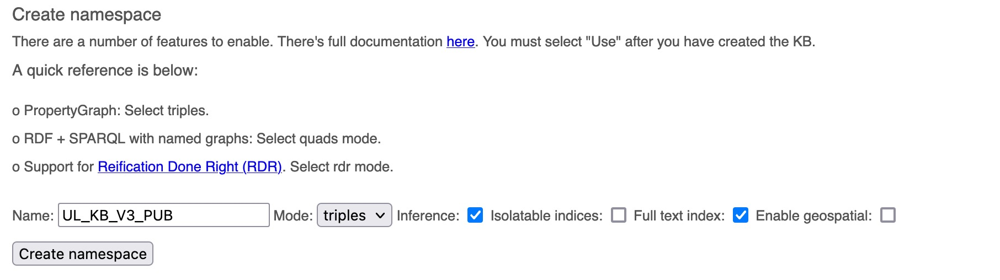
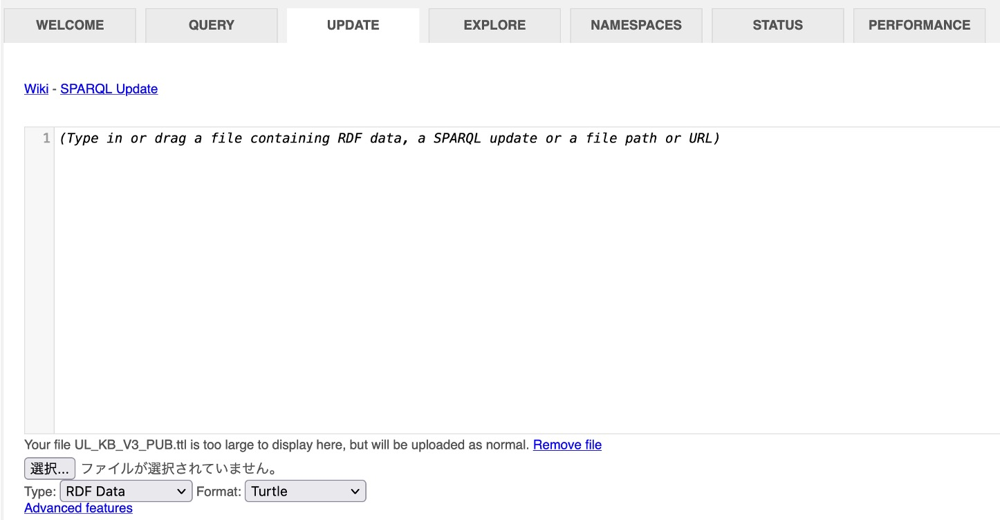
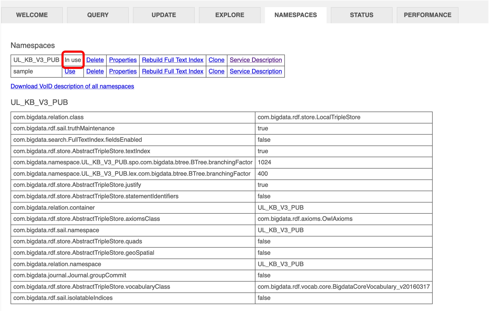

# INSTALLATION: amr-verbnet-semantics

## Create virtual environment
```
$ conda create -n amr-verbnet python=3.7
$ conda activate amr-verbnet
$ conda install -c anaconda graphviz
$ bash scripts/install.sh
$ 
$ # Ubuntu and Debian
$ sudo apt-get install graphviz graphviz-dev
$ pip install pygraphviz
$ 
$ # macOS
$ brew install graphviz
$ pip install pygraphviz
```
Note that the scripts/install.sh downloads some NLTK corpora like punkt, verbnet, and propbank. If you already have some existing corpora under ~/nltk-data, please do backup accordingly.

You can know how to install pygraphviz on other environments with 
[the document](https://pygraphviz.github.io/documentation/stable/install.html).


## Download linguistic resources
```
$ bash scripts/download_verbnet.sh ~/nltk_data/corpora/
$ bash scripts/download_propbank.sh ~/nltk_data/corpora/
$ bash scripts/download_semlink.sh ./data
$ bash scripts/download_stanford_nlp.sh ./
```


## Setup knowledge base
(1) download the .ttl file from [KG](https://github.com/CognitiveHorizons/AMR-CSLogic/tree/master/KG) and unzip it. As of 5th Oct, we are using UL_KB_V3_PUB.ttl.zip.  

(2) start a database server with the command `$ java -server -Xmx32g -jar blazegraph.jar`. You can see the server through `http://127.0.0.1:9999/blazegraph/`. 

(3) On the ‘namespaces’ tab, create a new namespace with the name you want. Make sure you tick ‘inference’ and ‘full text index’  


(4) On the ‘update’ tab, drag and drop one .ttl file you want to use and click ‘update’. 


(5) On the ‘namespaces’ tab, confirm that the namespace you want to use is running. 


(6) set the SPARQL_ENDPOINT address in the config.yaml file.


## Create config file
Note that we use YAML config file to set app specific parameters. To get started, create your own local config file using config_template.yaml file and customize values of difference fields if needed and save with name config.yaml.


## Download third_party
```
$ bash scripts/download_third_party.sh 
```
Secondly You have to download the pre-trained model file for AMR from the following path on CCC. 
Then you have to unzip the file in `third_party` directory and set the values of AMR_MODEL_CHECKPOINT_PATH and THIRD_PARTY_PATH in the config file accordingly.
- `/dccstor/ykt-parse/SHARED/MODELS/AMR/transition-amr-parser/amr2.0_v0.4.1_youngsuk_ensemble_destillation.zip`


## Start a Stanford CoreNLP server
If you would like to set up an independent server, cd into the CoreNLP package and run the following:
```
$ cd ./stanford-corenlp-full-2018-10-05/
$ java -mx4g -cp "*" edu.stanford.nlp.pipeline.StanfordCoreNLPServer -port 9000 -timeout 15000
```
If it says java.net.BindException: Address already in use for this port, either use another one or run
```
$ pkill java
```
to stop any existing ones. Then set STANFORD_CORENLP_PATH to null and fill in the host name and port number to use this running server.


## Start the FLASK server
```
$ export FLASK_APP=./amr_verbnet_semantics/web_app/__init__.py
$ python -m flask run --host=0.0.0.0
```
The Flask logs indicate what URL the service is running on.

To test the service, try a test example:
```
$ python amr_verbnet_semantics/test/test_service.py
```
